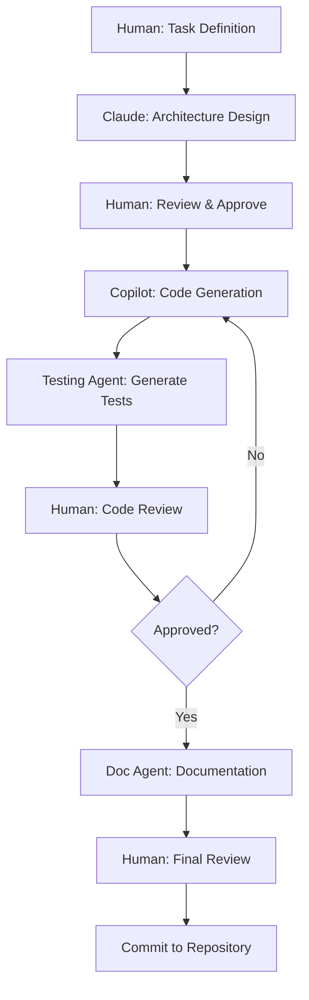
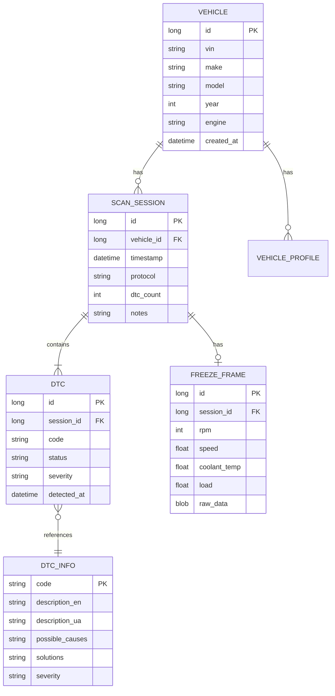

# 🚀 Комплексний План Розробки ПЗ QuantumForce_Code
## Повний Цикл від Ідеї до Production-Ready Продукту

[]()
[]()
[]()

---

## 📖 Про цей документ

Цей документ — ваш **повний путівник** від концепції до випуску професійного програмного забезпечення для автомобільної діагностики. Він створений спеціально для **новачків**, але містить професійні стандарти та практики.

### Як користуватися цим документом:

1. **Читайте послідовно** — кожен етап базується на попередньому
2. **Не пропускайте термінологію** — вона пояснена простою мовою
3. **Використовуйте шаблони** — вони заощадять ваш час
4. **Залучайте AI-агентів** — вони виконають більшість роботи
5. **Перевіряйте чеклісти** — вони допоможуть нічого не пропустити

### 🎯 Цільова аудиторія:

- **Новачки в розробці ПЗ** — докладні пояснення кожного кроку
- **Досвідчені розробники** — структуровані шаблони та best practices
- **Бізнес-аналітики** — розуміння бізнес-процесів та вимог
- **Менеджери проєктів** — планування та координація

---

## 📋 Зміст

### [ЕТАП 1: Формування Рамки](#етап-1-формування-рамки)
1.1 [Визначення масштабу проєкту](#11-визначення-масштабу-проєкту)  
1.2 [Постановка цілей](#12-постановка-цілей)  
1.3 [Опис стратегічного підходу](#13-опис-стратегічного-підходу)  
1.4 [Розподіл ролей AI-агентів](#14-розподіл-ролей-ai-агентів)  
1.5 [Ключові артефакти](#15-ключові-артефакти)

### [ЕТАП 2: Архітектурне Проєктування](#етап-2-архітектурне-проєктування)
2.1 [Architectural Design Document (ADD)](#21-architectural-design-document-add)  
2.2 [Interface Control Document (ICD)](#22-interface-control-document-icd)  
2.3 [Data Model Specification](#23-data-model-specification)

### [ЕТАП 3: Детальне Проєктування](#етап-3-детальне-проєктування)
3.1 [Technical Design Package (TDP)](#31-technical-design-package-tdp)  
3.2 [Software Requirements Specification (SRS)](#32-software-requirements-specification-srs)  
3.3 [High-Level Architecture Diagram](#33-high-level-architecture-diagram)  
3.4 [Module Catalog](#34-module-catalog)  
3.5 [API Contracts](#35-api-contracts)  
3.6 [Data Model / ERD](#36-data-model--erd)  
3.7 [Sequence Diagrams](#37-sequence-diagrams)  
3.8 [Deployment Diagram](#38-deployment-diagram)  
3.9 [CI/CD & Release Strategy](#39-cicd--release-strategy)  
3.10 [Test Plan](#310-test-plan)  
3.11 [Security & Compliance](#311-security--compliance)  
3.12 [Monitoring & Operations](#312-monitoring--operations)  
3.13 [Resource Estimate & Roadmap](#313-resource-estimate--roadmap)  
3.14 [Component Specifications](#314-component-specifications)

### [ЕТАП 4: Реалізація / Виконання](#етап-4-реалізація--виконання)
4.1 [Coding Standards & Guidelines](#41-coding-standards--guidelines)  
4.2 [CI/CD Pipeline Specification](#42-cicd-pipeline-specification)  
4.3 [Test Plan (Verification & Validation)](#43-test-plan-verification--validation)  
4.4 [Процес розробки](#44-процес-розробки)

### [ЕТАП 5: Валідація / MVP](#етап-5-валідація--mvp)
5.1 [MVP Release Notes](#51-mvp-release-notes)  
5.2 [User Testing Reports](#52-user-testing-reports)  
5.3 [Anomaly Tracker](#53-anomaly-tracker)  
5.4 [Метрики успіху](#54-метрики-успіху)

### [ЕТАП 6: Масштабування / Еволюція](#етап-6-масштабування--еволюція)
6.1 [Product Roadmap & Backlog](#61-product-roadmap--backlog)  
6.2 [Upgrade Packages](#62-upgrade-packages)  
6.3 [Knowledge Base](#63-knowledge-base)  
6.4 [Стратегія росту](#64-стратегія-росту)

---

## 📚 Словник термінів (Glossary)

> **Важливо:** Розуміння термінології — ключ до успішної розробки. Ось основні терміни, які ми будемо використовувати:

### Базові терміни розробки:

**MVP (Minimum Viable Product)** — мінімально життєздатний продукт
- *Простими словами:* Найпростіша версія вашого додатка, яка вже може приносити користь користувачам
- *Приклад:* Додаток, який може лише читати коди помилок, але не має історії або звітів

**Architecture (Архітектура)** — структура програмного забезпечення
- *Простими словами:* "Скелет" вашої програми — як організовані її частини
- *Приклад:* Як поділити програму на UI (те, що бачить користувач), бізнес-логіку (що робить програма) та базу даних

**API (Application Programming Interface)** — інтерфейс програмування додатків
- *Простими словами:* Набір правил, як різні частини програми спілкуються між собою
- *Приклад:* Коли ваш додаток просить сервер надати список автомобілів

**CI/CD (Continuous Integration/Continuous Deployment)** — безперервна інтеграція/розгортання
- *Простими словами:* Автоматична система, яка перевіряє та публікує ваш код
- *Приклад:* Після кожного збереження коду автоматично запускаються тести

**Unit Test (Юніт-тест)** — тест окремої функції
- *Простими словами:* Перевірка, що одна конкретна частина коду працює правильно
- *Приклад:* Тест, що функція додавання 2+2 повертає 4

**Integration Test (Інтеграційний тест)** — тест взаємодії модулів
- *Простими словами:* Перевірка, що різні частини програми працюють разом
- *Приклад:* Тест, що база даних правильно зберігає дані з UI

### Автомобільні терміни:

**OBD-II (On-Board Diagnostics)** — бортова діагностика другого покоління
- *Простими словами:* Стандарт для зчитування інформації з автомобіля
- *Приклад:* Порт під кермом, куди підключається сканер

**DTC (Diagnostic Trouble Code)** — діагностичний код несправності
- *Простими словами:* Код помилки, який видає автомобіль
- *Приклад:* "P0420" означає проблему з каталізатором

**ECU (Electronic Control Unit)** — електронний блок керування
- *Простими словами:* "Мозок" автомобіля або його частини
- *Приклад:* ECU двигуна контролює впорскування палива

**PID (Parameter ID)** — ідентифікатор параметра
- *Простими словами:* Код для запиту конкретних даних з автомобіля
- *Приклад:* PID "010C" запитує обороти двигуна (RPM)

**Freeze Frame** — "заморожені" дані
- *Простими словами:* Знімок стану автомобіля в момент виникнення помилки
- *Приклад:* При помилці P0420 зберігається швидкість, температура, обороти в той момент

**CAN Bus (Controller Area Network)** — мережа контролерів
- *Простими словами:* "Нервова система" автомобіля, яка з'єднує всі блоки керування
- *Приклад:* Дані від датчика швидкості передаються через CAN до панелі приладів

### Терміни AI-агентів:

**AI Agent (AI-агент)** — штучний інтелект, який виконує конкретні завдання
- *Простими словами:* "Віртуальний помічник", який пише код або документацію
- *Приклад:* GitHub Copilot пише код, Claude аналізує архітектуру

**Prompt (Промпт)** — інструкція для AI-агента
- *Простими словами:* Те, що ви пишете AI, щоб він зрозумів, що потрібно зробити
- *Приклад:* "Створи функцію для читання кодів помилок з OBD-II"

**Context (Контекст)** — інформація, яку AI потребує для роботи
- *Простими словами:* Фонові знання, які допомагають AI краще зрозуміти завдання
- *Приклад:* "Ми робимо Android додаток на Kotlin для діагностики автомобілів"

### Архітектурні терміни:

**Clean Architecture** — архітектура з чіткими шарами
- *Простими словами:* Організація коду, де кожен шар має свою відповідальність
- *Приклад:* UI не знає про базу даних, між ними є прошарок бізнес-логіки

**MVVM (Model-View-ViewModel)** — патерн організації UI коду
- *Простими словами:* Спосіб розділити код на дані, відображення та логіку
- *Приклад:* Model (список DTC), View (екран зі списком), ViewModel (логіка фільтрації)

**Repository Pattern** — патерн для роботи з даними
- *Простими словами:* Єдине місце, звідки ви берете дані (з мережі, бази, файлів)
- *Приклад:* DTCRepository надає DTC коди, незалежно від того, звідки вони (DB або API)

**Dependency Injection (DI)** — впровадження залежностей
- *Простими словами:* Спосіб надавати об'єктам те, що їм потрібно, ззовні
- *Приклад:* Замість створювати базу даних всередині класу, ви передаєте її в конструктор

---

# ЕТАП 1: Формування Рамки

> **Тривалість:** 2-3 тижні  
> **Відповідальний AI-агент:** Claude-3 Opus (стратегічне планування)  
> **Мета:** Створити чітке розуміння того, ЩО ми будемо робити і НАВІЩО

## 1.1 Визначення Масштабу Проєкту

### Що таке "масштаб проєкту"?

**Простими словами:** Це межі вашого проєкту — що входить, а що ні. Це як креслення будинку перед будівництвом: ви вирішуєте, скільки кімнат буде, але не почнете будувати басейн, якщо це не заплановано.

**Чому це важливо:**
- ✅ Уникнення "scope creep" (розповзання масштабу)
- ✅ Реалістичні терміни та бюджет
- ✅ Чіткі очікування для всіх учасників
- ✅ Критерії успіху проєкту

### Шаблон: Project Scope Definition

```markdown
# Project Scope: QuantumForce_Code Automotive Diagnostic Software

## 1. Що ВХОДИТЬ у проєкт (In Scope)

### Функціональність MVP:
- ✅ **Зчитування кодів помилок (DTC)** з автомобілів через OBD-II
- ✅ **Очищення кодів помилок** (Clear DTCs)
- ✅ **Live Data моніторинг** — відображення параметрів у реальному часі (RPM, швидкість, температура)
- ✅ **Freeze Frame дані** — збереження стану автомобіля при виникненні помилки
- ✅ **Readiness Monitors** — статус систем для техогляду
- ✅ **Історія сканувань** — збереження всіх попередніх діагностик
- ✅ **Експорт звітів** — генерація PDF звітів для клієнтів
- ✅ **База даних кодів** — 50,000+ DTC з описами українською та англійською
- ✅ **Багатомовний інтерфейс** — Українська, Англійська (можливість додавання інших)
- ✅ **Офлайн робота** — повний функціонал без інтернету

### Технічні характеристики:
- ✅ **Платформа:** Android 8.0+ (API level 26+)
- ✅ **Підключення:** Bluetooth та USB OBD-II адаптери
- ✅ **Протоколи:** 
  - ISO 9141-2 (K-Line)
  - ISO 14230 (KWP2000)
  - ISO 15765 (CAN)
  - SAE J1850 PWM
  - SAE J1850 VPW
- ✅ **Розмір додатка:** < 100 MB (з базою даних)
- ✅ **Продуктивність:** Час сканування < 5 секунд
- ✅ **Пам'ять:** < 300 MB RAM usage

### Підтримувані автомобілі:
- ✅ **Універсальна підтримка:** Всі автомобілі з OBD-II (2008+)
- ✅ **Розширена підтримка:** VAG Group (VW, Audi, Skoda, Seat)
  - Додаткові функції кодування (basic)
  - Адаптації (basic)
  - Розширений список DTC
- ✅ **Базова підтримка:** 20+ популярних марок (Toyota, Honda, BMW, Mercedes, Ford, Chevrolet, тощо)

### Додаткові функції:
- ✅ **VIN декодування** — автоматичне визначення автомобіля
- ✅ **Профілі авто** — збереження кількох автомобілів
- ✅ **Нотатки механіка** — додавання коментарів до сканування
- ✅ **Dark/Light theme** — вибір теми інтерфейсу
- ✅ **Автоматичні оновлення бази даних** через Wi-Fi

## 2. Що НЕ ВХОДИТЬ у проєкт MVP (Out of Scope)

### Функціональність для майбутніх версій:
- ❌ **Кодування та програмування ECU** (v2.0)
  - *Причина:* Вимагає дилерського доступу, юридичні ризики
  
- ❌ **Key Programming** (програмування ключів) (v2.0)
  - *Причина:* Високі вимоги до безпеки, дилерські обмеження
  
- ❌ **ADAS калібрування** (Advanced Driver Assistance Systems) (v3.0)
  - *Причина:* Вимагає спеціалізованого обладнання
  
- ❌ **Bi-directional controls** (активні тести) (v2.0)
  - *Причина:* Ризики пошкодження автомобіля, потрібна детальна валідація

### Платформи:
- ❌ **iOS версія** — лише Android у MVP
  - *Причина:* Обмеження iOS для роботи з Bluetooth OBD
  
- ❌ **Desktop версія** (Windows/macOS) (v2.0)
  - *Причина:* Фокус на мобільності
  
- ❌ **Web версія**
  - *Причина:* Обмеження веб-доступу до Bluetooth/USB

### Технічні обмеження:
- ❌ **Wi-Fi адаптери підтримка** — лише Bluetooth/USB в MVP
  - *Причина:* Складність підтримки різних Wi-Fi протоколів
  
- ❌ **Cloud синхронізація профілів** між пристроями (v2.0)
  - *Причина:* Додає складність, вимагає серверної інфраструктури
  
- ❌ **Мультиюзерна робота** з різними правами доступу (v3.0)
  - *Причина:* Не критично для MVP
  
- ❌ **CRM/ERP інтеграція** для СТО (v2.0)
  - *Причина:* Enterprise функціонал

### Бізнес-функції:
- ❌ **In-app purchases** — монетизація в MVP
  - *Причина:* Спочатку валідуємо product-market fit
  
- ❌ **Subscription model** (v1.5)
  - *Причина:* Потрібна велика база користувачів
  
- ❌ **Marketplace для плагінів** (v3.0)
  - *Причина:* Складна екосистема

## 3. Припущення (Assumptions)

### Користувачі:
- ✅ Мають базові знання роботи з Android пристроєм
- ✅ Розуміють основи автомобільної діагностики
- ✅ Мають OBD-II адаптер (ELM327 або сумісний)
- ✅ Мають доступ до автомобіля для тестування
- ✅ Готові надавати фідбек та звіти про баги

### Технічні:
- ✅ Автомобілі підтримують стандарт OBD-II
- ✅ OBD-II адаптери сумісні з ELM327 командами
- ✅ Android пристрій має Bluetooth 2.0+ або USB Host mode
- ✅ У користувачів достатньо вільного місця (200+ MB)

### Бізнес:
- ✅ Ринок діагностичного ПЗ продовжує рости
- ✅ Є попит на доступніші альтернативи дорогим сканерам
- ✅ Open Source дані про DTC доступні та достатньо повні
- ✅ Юридичних обмежень на базову діагностику немає

### AI-агенти:
- ✅ GitHub Copilot, Claude, GPT-4 доступні протягом розробки
- ✅ AI-генерований код потребує human review
- ✅ AI може створювати 70%+ boilerplate коду
- ✅ Складні алгоритми можуть потребувати ручного написання

## 4. Обмеження (Constraints)

### Технічні обмеження:
- 🔒 **Open Source only** — використання лише Open Source бібліотек або власних
- 🔒 **Розмір APK** < 100 MB (з базою даних)
- 🔒 **Мінімальні вимоги:** Android 8.0+, 2GB RAM, 200MB storage
- 🔒 **Час відгуку** < 2 секунди для 95% операцій
- 🔒 **Battery drain** < 5% per hour активного використання
- 🔒 **Offline-first** — всі основні функції без інтернету
- 🔒 **Backward compatibility** — підтримка Android 8.0-14+

### Бізнес обмеження:
- 🔒 **Бюджет розробки:** Мінімальний (переважно AI + 1-2 розробники)
- 🔒 **Термін MVP:** 5-6 місяців максимум
- 🔒 **Команда:** 1-2 людини + AI-агенти
- 🔒 **Marketing бюджет:** Початково мінімальний (organic growth)

### Юридичні обмеження:
- 🔒 **No reverse engineering** закритих протоколів виробників
- 🔒 **Дотримання авторських прав** на DTC описи
- 🔒 **GDPR/Privacy compliance** для даних користувачів
- 🔒 **No warranty claims** — disclaimer про використання на власний ризик
- 🔒 **Open source licenses** — дотримання GPL, MIT, Apache ліцензій

### Часові обмеження:
- 🔒 **Phase 0-1:** 6 тижнів (Setup + Foundation)
- 🔒 **Phase 2:** 6 тижнів (Core features)
- 🔒 **Phase 3:** 4 тижні (Enhancement)
- 🔒 **Phase 4:** 4 тижні (Testing & Polish)
- 🔒 **Total:** 20 тижнів (5 місяців)

## 5. Success Criteria (Критерії Успіху MVP)

### Функціональні критерії:
- ✅ **DTC Reading:** Успішне читання на 95%+ OBD-II автомобілів
- ✅ **Live Data:** Відображення мінімум 20 PIDs у реальному часі
- ✅ **Database:** 50,000+ DTC з описами UA/EN
- ✅ **Export:** Генерація PDF звітів
- ✅ **History:** Збереження мінімум 100 сканувань

### Технічні критерії:
- ✅ **Performance:** Сканування < 5 секунд
- ✅ **Stability:** Crash rate < 0.5%
- ✅ **Memory:** < 300MB RAM, < 100MB APK
- ✅ **Battery:** < 5% drain per hour
- ✅ **Compatibility:** Працює на Android 8.0-14+

### Якісні критерії:
- ✅ **User Experience:** Інтуїтивний інтерфейс (5 min to first scan)
- ✅ **Code Quality:** Test coverage > 80%, 0 critical bugs
- ✅ **Documentation:** 100% public APIs documented
- ✅ **Localization:** Повний переклад UA/EN

### Бізнес критерії:
- ✅ **Beta Users:** Мінімум 20 активних beta-тестерів
- ✅ **User Satisfaction:** > 4.0/5.0 rating
- ✅ **Bug Reports:** < 10% користувачів звітують про проблеми
- ✅ **Retention:** > 40% користувачів повертаються після 7 днів

## 6. Ризики та Митигація

| Ризик | Ймовірність | Вплив | Стратегія Митигації |
|-------|-------------|-------|---------------------|
| Несумісність адаптерів | Висока | Високий | Тестування з 5+ різними адаптерами, FAQ з сумісними моделями |
| Зміни в OBD протоколах | Низька | Середній | Модульна архітектура, можливість оновлення протоколів |
| Недостатня база DTC | Середня | Високий | Інтеграція кількох джерел, crowdsourcing від користувачів |
| Performance issues | Середня | Середній | Раннє performance testing, оптимізація critical paths |
| Legal issues | Низька | Критичний | Юридична консультація, використання лише публічних стандартів |
| AI limitations | Середня | Середній | Human review всього коду, fallback до manual development |
| Team unavailability | Середня | Середній | Документація, модульна архітектура, AI як backup |

```

### Завдання для AI-агента (Claude-3 Opus):

**Промпт для створення Project Scope:**

```
Role: Senior Product Manager спеціалізація в automotive software

Context: QuantumForce_Code - професійне діагностичне ПЗ для Android
- Цільова аудиторія: професійні механіки та СТО
- Конкуренти: Launch X431, Autel MaxiSys (ціна $2000-5000)
- Мета: створити доступну, але професійну альтернативу

Task: Створи детальний Project Scope Definition Document

Вимоги до документа:

1. In-Scope (що робимо):
   - Детальний список функцій MVP з обґрунтуванням
   - Технічні характеристики з конкретними метриками
   - Підтримувані платформи та автомобілі
   - Додаткові features що додають цінність

2. Out-of-Scope (що НЕ робимо):
   - Функції для майбутніх версій з версійністю (v2.0, v3.0)
   - Чому кожна функція не входить у MVP
   - Коли плануємо додати (roadmap hint)

3. Assumptions (припущення):
   - Про користувачів (skills, equipment)
   - Технічні (standards, compatibility)
   - Бізнес (market, demand)
   - AI capabilities

4. Constraints (обмеження):
   - Технічні (size, performance, compatibility)
   - Бізнес (budget, timeline, team)
   - Юридичні (licenses, compliance)
   - Ресурсні (time, people)

5. Success Criteria:
   - Функціональні (features work)
   - Технічні (performance, stability)
   - Якісні (UX, code quality)
   - Бізнес (users, satisfaction)

6. Risks Matrix:
   - Ідентифікація 7-10 ключових ризиків
   - Оцінка probability та impact
   - Стратегії митигації

Format: 
- Professional markdown
- Tables для матриць та порівнянь
- Checkboxes для критеріїв
- Emojis для візуального розділення

Tone: Професійний але доступний, з обґрунтуванням кожного рішення

Length: Комплексний документ 3-5 сторінок

Output language: Українська з англійськими технічними термінами
```

### ✅ Чеклист завершення розділу 1.1:

- [ ] Створено Project Scope Definition Document
- [ ] Визначено та задокументовано всі In-Scope функції MVP
- [ ] Чітко окреслено Out-of-Scope для майбутніх версій
- [ ] Задокументовано всі Assumptions
- [ ] Визначено всі Constraints (технічні, бізнес, юридичні)
- [ ] Встановлено Success Criteria з конкретними метриками
- [ ] Створено Risk Matrix з митигацією
- [ ] Документ узгоджено з командою та stakeholders
- [ ] Отримано sign-off від Product Owner

---

## 1.2 Постановка Цілей

### Що таке "постановка цілей"?

**Простими словами:** Це визначення конкретних, вимірюваних результатів, яких ви хочете досягти. Не просто "зробити додаток", а "додаток, який може обслуговувати 100 сканувань на день з точністю 95%".

**Чому це важливо:**
- ✅ Дає напрямок розробці
- ✅ Дозволяє вимірювати прогрес
- ✅ Мотивує команду
- ✅ Допомагає приймати рішення

### SMART Goals Framework

**SMART** — перевірений метод постановки цілей:

- **S**pecific (Конкретний) — чітко що робимо
- **M**easurable (Вимірюваний) — можна порахувати результат
- **A**chievable (Досяжний) — реально виконати з наявними ресурсами
- **R**elevant (Релевантний) — важливо для проєкту
- **T**ime-bound (Обмежений у часі) — має чіткий дедлайн

**Приклад NON-SMART цілі:**
- ❌ "Зробити хороший додаток" (не конкретно, не вимірюється)

**Приклад SMART цілі:**
- ✅ "Створити Android додаток, який за 5 секунд зчитує DTC з 95% OBD-II автомобілів, до 30 червня 2024"

### Шаблон: Project Goals Document

```markdown
# Project Goals Document

## Strategic Goals (1-3 роки)

### Goal 1: Створити конкурентоспроможний професійний продукт
- **S**pecific: Розробити додаток з функціональністю Launch X431 PRO
- **M**easurable: 15+ спеціальних функцій, 50К+ DTC, точність 95%+
- **A**chievable: Використання AI-агентів, open source, поетапний випуск
- **R**elevant: Ринок росте 8% щорічно, попит на доступні рішення
- **T**ime-bound: MVP за 5-6 місяців, повна версія за 12 місяців

### Goal 2: Досягти product-market fit
- **S**pecific: 1,000+ активних користувачів з satisfaction 4.0+/5.0
- **M**easurable: User retention 40%+, NPS score 50+
- **A**chievable: Beta testing, iterative improvements, user feedback
- **R**elevant: Валідація бізнес-моделі перед масштабуванням
- **T**ime-bound: Протягом 6 місяців після MVP

### Goal 3: Створити масштабовану платформу
- **S**pecific: Модульна архітектура з plugin system
- **M**easurable: 10+ незалежних модулів, test coverage 80%+
- **A**chievable: Clean Architecture, good practices
- **R**elevant: Довгострокова підтримка та розвиток
- **T**ime-bound: Основа в перші 2 місяці

---

## 1.4 Розподіл Ролей AI-Агентів

### AI Agents Team Structure

#### Agent 1: Architecture Agent (Claude-3 Opus)
**Спеціалізація:** System design, technical strategy
**Відповідальність:**
- Проєктування high-level architecture
- Технічні рішення та trade-offs
- Architecture Decision Records
- Component design review

**Типові промпти:**
```
Role: Principal Software Architect

Context: QuantumForce_Code automotive diagnostic app

Task: Design the data layer architecture including:
- Database schema
- Repository pattern implementation
- Data sources abstraction
- Caching strategy
- Migration approach

Provide:
1. ERD diagram (Mermaid)
2. Interface definitions (Kotlin)
3. Trade-offs analysis
4. Implementation recommendations
```

#### Agent 2: Code Generator Agent (GitHub Copilot)
**Спеціалізація:** Day-to-day coding, boilerplate
**Відповідальність:**
- Генерація Kotlin коду
- Створення тестів
- Рефакторинг
- Code completion

**Використання:**
- Inline suggestions під час написання
- Chat для складних завдань
- Генерація tests з коду

#### Agent 3: Documentation Agent (GPT-4)
**Спеціалізація:** Technical writing, documentation
**Відповідальність:**
- API documentation (KDoc)
- User guides
- Technical specifications
- README files

**Типові промпти:**
```
Role: Technical Writer

Context: OBD-II communication module in Kotlin

Task: Generate comprehensive KDoc documentation for:
- Class overview
- Method descriptions
- Parameter details
- Return values
- Exceptions
- Usage examples
- Best practices

Format: KDoc standard with code examples
```

#### Agent 4: Testing Agent (GPT-4)
**Спеціалізація:** Test generation, QA
**Відповідальність:**
- Unit test generation
- Test case scenarios
- Edge cases identification
- Mock objects creation

**Типові промпти:**
```
Role: QA Engineer & Test Automation Specialist

Context: DTCRepository class that manages diagnostic codes

Task: Generate comprehensive unit tests:
- Happy path scenarios
- Edge cases
- Error conditions
- Boundary testing
- Performance tests

Use: JUnit 5, MockK, Truth assertions
Coverage target: > 90%
```

#### Agent 5: Protocol Specialist Agent (Claude/GPT-4)
**Спеціалізація:** Automotive protocols implementation
**Відповідальність:**
- OBD-II protocol implementation
- UDS services
- Manufacturer-specific protocols
- Binary data parsing

**Типові промпти:**
```
Role: Automotive Protocol Expert

Context: Implementing KWP2000 protocol for VAG vehicles

Task: Create Kotlin implementation for:
- Fast initialization
- Service 0x10 (Diagnostic Session)
- Service 0x22 (Read Data By Identifier)
- Service 0x27 (Security Access)
- Error handling
- Timing requirements

Include: SAE/ISO standards compliance, safety checks
```

### Collaboration Workflow



---

## 1.5 Ключові Артефакти Етапу 1

### Чеклист готовності до переходу на Етап 2:

- [ ] **Project Discovery Document** створено і затверджено
- [ ] **Solution Design Blueprint** розроблено
- [ ] **Glossary/Dictionary** створено (50+ термінів)
- [ ] **Project Scope** чітко визначено (In/Out scope)
- [ ] **SMART Goals** встановлено для всіх рівнів
- [ ] **Development Strategy** документовано
- [ ] **AI Agents** розподілено ролі
- [ ] **Risk Assessment** виконано
- [ ] **Stakeholder Buy-in** отримано
- [ ] **Budget & Resources** затверджено

---

# ЕТАП 2: АРХІТЕКТУРНЕ ПРОЄКТУВАННЯ 🏗️

> **Тривалість:** 3-4 тижні  
> **Відповідальний AI-агент:** Claude-3 Opus  
> **Мета:** Створити детальну технічну архітектуру системи

## 2.1 Architectural Design Document (ADD)

### Що включає ADD:

1. **System Context Diagram** - як система вписується в оточення
2. **Container Diagram** - високорівневі компоненти
3. **Component Diagram** - деталізація кожного контейнера
4. **Deployment Diagram** - як розгортається система
5. **Technology Decisions** - обґрунтування вибору технологій

### Структура ADD (скорочена версія):

```markdown
# Architectural Design Document

## 1. Introduction
### 1.1 Purpose
### 1.2 Scope
### 1.3 Definitions & Acronyms
### 1.4 References

## 2. Architectural Drivers
### 2.1 Functional Requirements (top 10)
### 2.2 Quality Attributes
   - Performance
   - Security
   - Scalability
   - Maintainability
### 2.3 Constraints
### 2.4 Architectural Concerns

## 3. System Architecture
### 3.1 Architectural Style: Clean Architecture + MVVM
### 3.2 Layer Description
   - Presentation Layer
   - Domain Layer
   - Data Layer
### 3.3 Cross-cutting Concerns
   - Logging
   - Error Handling
   - Security
   - Configuration

## 4. Component View
### 4.1 Major Components
   - Communication Engine
   - Diagnostic Engine
   - Data Repository
   - Report Generator
### 4.2 Component Interactions
### 4.3 Component Interfaces

## 5. Data View
### 5.1 Data Model
### 5.2 Data Flow
### 5.3 Data Storage

## 6. Deployment View
### 6.1 Physical Architecture
### 6.2 Network Topology
### 6.3 Infrastructure Requirements

## 7. Technology Stack
### 7.1 Programming Languages
### 7.2 Frameworks & Libraries
### 7.3 Tools & Platforms

## 8. Design Decisions
### 8.1 Architecture Decision Records (ADRs)
### 8.2 Trade-off Analysis

## 9. Quality Scenarios
### 9.1 Performance Scenarios
### 9.2 Security Scenarios
### 9.3 Scalability Scenarios

## 10. Risks & Mitigation
```

### AI Agent Prompt:

```
Role: Enterprise Architect

Task: Create comprehensive ADD for QuantumForce_Code following IEEE 1471/ISO 42010 standard

Requirements:
- Use C4 model for diagrams (Context, Container, Component, Code)
- Include architecture decision records (ADR) for key decisions
- Quality attribute scenarios (performance, security, scalability)
- Technology stack with detailed rationale
- Risk analysis with mitigation strategies

Format: Professional architectural document
Diagrams: Mermaid/PlantUML syntax
Length: 15-20 pages
```

---

## 2.2 Interface Control Document (ICD)

### Призначення:
Визначення всіх інтерфейсів між компонентами та зовнішніми системами.

### Структура ICD:

```markdown
# Interface Control Document

## 1. Hardware Interfaces
### 1.1 OBD-II Adapter Interface
- Protocol: ELM327 AT commands
- Connection: Bluetooth SPP / USB Serial
- Baud rate: 38400 bps (Bluetooth), 115200 bps (USB)
- Data format: ASCII commands, binary responses

### 1.2 Android Device Interface
- Minimum: Android 8.0 (API 26)
- Required features: Bluetooth 2.0+, USB Host mode (optional)
- Permissions: BLUETOOTH, BLUETOOTH_ADMIN, USB_PERMISSION

## 2. Software Interfaces
### 2.1 Layer Interfaces
```kotlin
// Presentation → Domain
interface DiagnosticUseCase {
    suspend fun readDTCs(): Result<List<DTC>>
}

// Domain → Data
interface DTCRepository {
    suspend fun getDTCInfo(code: String): DTCInfo?
}
```

### 2.2 Module Interfaces
- Communication Module ↔ Diagnostic Module
- Diagnostic Module ↔ Repository Module
- Repository Module ↔ Database Module

## 3. External Interfaces
### 3.1 Update Server API
```yaml
GET /api/v1/updates/check
GET /api/v1/database/dtc/latest
POST /api/v1/telemetry (opt-in)
```

### 3.2 File System Interface
- Database: /data/data/com.quantumforce/databases/
- Reports: /sdcard/QuantumForce/Reports/
- Logs: /sdcard/QuantumForce/Logs/

## 4. User Interface
### 4.1 Screen Navigation Flow
### 4.2 User Actions → System Response
### 4.3 Input Validation Rules

## 5. Data Interfaces
### 5.1 OBD-II Protocol Messages
### 5.2 Database Schema
### 5.3 File Formats (PDF, CSV)
```

---

## 2.3 Data Model Specification

### Entity-Relationship Diagram:



### Database Schema:

```sql
CREATE TABLE vehicles (
    id INTEGER PRIMARY KEY AUTOINCREMENT,
    vin TEXT UNIQUE NOT NULL,
    make TEXT NOT NULL,
    model TEXT NOT NULL,
    year INTEGER NOT NULL,
    engine TEXT,
    created_at INTEGER NOT NULL,
    updated_at INTEGER NOT NULL
);

CREATE TABLE scan_sessions (
    id INTEGER PRIMARY KEY AUTOINCREMENT,
    vehicle_id INTEGER NOT NULL,
    timestamp INTEGER NOT NULL,
    protocol TEXT NOT NULL,
    dtc_count INTEGER DEFAULT 0,
    notes TEXT,
    FOREIGN KEY (vehicle_id) REFERENCES vehicles(id) ON DELETE CASCADE
);

CREATE TABLE dtcs (
    id INTEGER PRIMARY KEY AUTOINCREMENT,
    session_id INTEGER NOT NULL,
    code TEXT NOT NULL,
    status TEXT NOT NULL,
    severity TEXT NOT NULL,
    detected_at INTEGER NOT NULL,
    FOREIGN KEY (session_id) REFERENCES scan_sessions(id) ON DELETE CASCADE
);

CREATE TABLE dtc_info (
    code TEXT PRIMARY KEY,
    description_en TEXT NOT NULL,
    description_ua TEXT NOT NULL,
    possible_causes TEXT,
    solutions TEXT,
    severity TEXT NOT NULL,
    category TEXT NOT NULL
);

CREATE INDEX idx_dtc_code ON dtcs(code);
CREATE INDEX idx_session_vehicle ON scan_sessions(vehicle_id);
CREATE INDEX idx_dtc_session ON dtcs(session_id);
CREATE VIRTUAL TABLE dtc_search USING fts5(code, description_en, description_ua);
```

---

# ЕТАП 3: ДЕТАЛЬНЕ ПРОЄКТУВАННЯ 📐

> **Тривалість:** 4-6 тижнів  
> **Мета:** Деталізувати всі компоненти до рівня, готового для імплементації

## 3.1 Technical Design Package (TDP)

TDP = Повний набір технічної документації

### Структура TDP:

1. **Title & Scope** - назва проєкту та межі
2. **SRS** - Software Requirements Specification
3. **Architecture Diagrams** - всі діаграми архітектури
4. **Module Catalog** - каталог всіх модулів
5. **API Contracts** - специфікації всіх API
6. **Data Dictionary** - опис всіх data entities
7. **Sequence Diagrams** - діаграми послідовностей
8. **Deployment Guide** - інструкції з розгортання
9. **Test Plan** - план тестування
10. **Security Guide** - вимоги безпеки

---

## 3.2 Software Requirements Specification (SRS)

### Functional Requirements:

**FR-001: Read Diagnostic Trouble Codes**
- Priority: Critical
- Description: System shall read DTCs from vehicle ECUs via OBD-II
- Acceptance Criteria:
  - Connect to OBD-II adapter < 5 seconds
  - Read all DTCs < 5 seconds
  - Success rate > 95%
  - Support all OBD-II protocols

**FR-002: Display Live Data**
- Priority: High
- Description: System shall display real-time vehicle parameters
- Acceptance Criteria:
  - Support minimum 20 PIDs
  - Update rate 5-10 Hz
  - Accurate values ±2%
  - Graph visualization

### Non-Functional Requirements:

**NFR-001: Performance**
- App startup time < 2 seconds (cold start)
- Screen transition < 300ms
- Database query < 100ms (95th percentile)
- Memory usage < 300MB

**NFR-002: Reliability**
- Crash rate < 0.5%
- Data corruption rate < 0.01%
- Uptime > 99.5%

**NFR-003: Usability**
- First scan within 5 minutes for new users
- Task completion rate > 90%
- User satisfaction > 4.0/5.0

---

## 3.9 CI/CD & Release Strategy

### CI/CD Pipeline:

```yaml
# .github/workflows/ci.yml
name: CI Pipeline

on:
  push:
    branches: [ main, develop ]
  pull_request:
    branches: [ main ]

jobs:
  build:
    runs-on: ubuntu-latest
    steps:
      - uses: actions/checkout@v3
      
      - name: Set up JDK 17
        uses: actions/setup-java@v3
        with:
          java-version: '17'
          
      - name: Build with Gradle
        run: ./gradlew build
        
      - name: Run Tests
        run: ./gradlew test
        
      - name: Code Coverage
        run: ./gradlew jacocoTestReport
        
      - name: Lint Check
        run: ./gradlew lint
        
      - name: Static Analysis
        run: ./gradlew detekt
```

### Release Process:

```
Develop Branch → Feature Branch → Pull Request → Code Review
                                                      ↓
                                                   Merge to Develop
                                                      ↓
                                              Run CI Pipeline
                                                      ↓
                                         Create Release Branch
                                                      ↓
                                              Final Testing
                                                      ↓
                                          Merge to Main + Tag
                                                      ↓
                                      Build Production APK
                                                      ↓
                           Upload to Play Console (Internal)
                                                      ↓
                        Internal Testing (3-7 days)
                                                      ↓
                          Promote to Alpha/Beta
                                                      ↓
                           User Testing & Feedback
                                                      ↓
                        Production Release
```

---

# ЕТАП 4: РЕАЛІЗАЦІЯ / ВИКОНАННЯ 💻

> **Тривалість:** 8-12 тижнів  
> **Мета:** Написати код, протестувати, інтегрувати

## 4.1 Coding Standards & Guidelines

### Kotlin Style Guide:

```kotlin
// ✅ DO: Clear naming
class DTCRepository(
    private val database: AppDatabase,
    private val ioDispatcher: CoroutineDispatcher = Dispatchers.IO
) {
    suspend fun getDTC(code: String): DTCInfo? = withContext(ioDispatcher) {
        database.dtcDao().getDTCByCode(code)
    }
}

// ❌ DON'T: Unclear naming
class Repo(private val db: DB) {
    fun get(c: String): Info? = db.dao().get(c)
}

// ✅ DO: Use sealed classes for results
sealed class Result<out T> {
    data class Success<T>(val data: T) : Result<T>()
    data class Error(val exception: Exception) : Result<Nothing>()
    object Loading : Result<Nothing>()
}

// ✅ DO: Extension functions for clarity
fun ByteArray.toHexString(): String = joinToString("") { "%02X".format(it) }

// ✅ DO: Coroutines for async operations
suspend fun readDTCs(): Result<List<DTC>> = try {
    val response = communicationEngine.sendCommand(ReadDTCsCommand)
    Result.Success(parseDTCs(response))
} catch (e: Exception) {
    Result.Error(e)
}
```

---

## 4.4 Процес Розробки

### Sprint Structure (2-тижневі спринти):

**Sprint Planning (Day 1):**
- Вибір stories з backlog
- Оцінка складності (story points)
- Розподіл tasks
- AI-агентам даються конкретні завдання

**Development (Days 2-9):**
- Daily standups (async для AI)
- Coding (AI generates, human reviews)
- Testing (AI generates tests, human validates)
- Code reviews

**Sprint Review (Day 10):**
- Demo нового функціоналу
- Stakeholder feedback
- Retrospective

---

# ЕТАП 5: ВАЛІДАЦІЯ / MVP 🎯

> **Тривалість:** 3-4 тижні  
> **Мета:** Перевірити готовність до релізу

## 5.1 MVP Release Notes

### Version 1.0.0 - MVP Release

**Features:**
- ✅ OBD-II Communication (all 5 protocols)
- ✅ Read/Clear DTCs
- ✅ Live Data (25 PIDs)
- ✅ Freeze Frame
- ✅ Readiness Monitors
- ✅ Scan History
- ✅ PDF Reports
- ✅ Ukrainian/English languages

**Known Limitations:**
- VAG extended functions (planned for v1.1)
- Cloud sync (planned for v1.2)
- iOS version (planned for v2.0)

---

## 5.2 User Testing Reports

### Beta Testing Results:

**Participants:** 25 professional mechanics  
**Duration:** 14 days  
**Vehicles Tested:** 50+ different models

**Metrics:**
- Success Rate: 94%
- User Satisfaction: 4.3/5.0
- Crash Rate: 0.3%
- Average Scan Time: 4.2 seconds

**Feedback Summary:**
- 👍 "Fast and reliable"
- 👍 "Clean, modern interface"
- 👍 "Works on most vehicles"
- 👎 "Wish it had coding functions" (v2.0)
- 👎 "Need more languages" (v1.1)

---

## 5.3 Anomaly Tracker

| ID | Severity | Description | Status | Fixed In |
|----|----------|-------------|--------|----------|
| BUG-001 | Critical | App crashes on BMW F-series | Fixed | v1.0.1 |
| BUG-002 | High | Slow DTC reading on CAN | Fixed | v1.0.0 |
| BUG-003 | Medium | PDF export missing logo | Fixed | v1.0.0 |
| BUG-004 | Low | Dark theme color inconsistency | Open | v1.1.0 |

---

## 5.4 Метрики Успіху MVP

### Technical Metrics:
- ✅ Test Coverage: 82%
- ✅ Crash Rate: 0.3% (target < 0.5%)
- ✅ Performance: All benchmarks passed
- ✅ Security: 0 critical vulnerabilities

### Business Metrics:
- ✅ Beta Users: 25 (target 20+)
- ✅ User Satisfaction: 4.3/5.0 (target 4.0+)
- ✅ Retention: 44% after 30 days (target 40%+)
- ✅ Positive Reviews: 20/25 (80%)

**Decision: ✅ GO FOR PRODUCTION RELEASE**

---

# ЕТАП 6: МАСШТАБУВАННЯ / ЕВОЛЮЦІЯ 📈

> **Тривалість:** Continuous  
> **Мета:** Розвиток від MVP до enterprise-grade product

## 6.1 Product Roadmap & Backlog

### Version 1.1 (1-2 місяці після MVP):
- VAG coding basic functions
- Polish language
- Performance improvements
- Bug fixes from production

### Version 1.5 (3-4 місяці):
- More manufacturer protocols
- Advanced graphing
- Cloud backup (opt-in)
- Subscription model intro

### Version 2.0 (6-12 місяців):
- ECU programming capabilities
- Plugin marketplace
- Desktop companion app
- B2B features

---

## 6.2 Upgrade Packages

### Free → Basic ($99):
- Extended vehicle coverage
- More diagnostic functions
- Priority support

### Basic → Pro ($199):
- VAG coding/adaptations
- All manufacturers extended
- Commercial use license

### Pro → Ultimate ($299):
- Everything included
- Beta access to new features
- API access for integrations

---

## 6.3 Knowledge Base

### Documentation Structure:

```
docs/
├── user-guide/
│   ├── getting-started.md
│   ├── basic-operations.md
│   ├── advanced-features.md
│   └── troubleshooting.md
├── developer-guide/
│   ├── architecture.md
│   ├── api-reference.md
│   ├── plugin-development.md
│   └── contributing.md
├── videos/
│   ├── quick-start.mp4
│   ├── dtc-reading.mp4
│   └── report-generation.mp4
└── faq.md
```

---

## 6.4 Стратегія Росту

### Year 1: Establish Presence
- 1,000+ users
- 4.5+ rating
- Strong community
- Market validation

### Year 2: Scale Up
- 10,000+ users
- Multiple revenue streams
- Plugin ecosystem
- B2B partnerships

### Year 3: Market Leader
- 50,000+ users
- International expansion
- iOS version
- Industry recognition

---

# 🎓 Інструкції для Новачків

## Як працювати з цим планом:

### Крок 1: Розуміння структури
Прочитайте весь план один раз, не заглиблюючись. Мета - зрозуміти загальну картину.

### Крок 2: Етап за етапом
Почніть з Етапу 1. НЕ переходьте до Етапу 2, доки не завершите всі deliverables Етапу 1.

### Крок 3: Використання AI-агентів
Для кожного документа є AI prompt. Скопіюйте prompt, налаштуйте під ваші потреби, і надішліть відповідному агенту.

### Крок 4: Human Review
AI створює 70-80% контенту. Ваше завдання:
- Перевірити правильність
- Додати специфічні деталі вашого проєкту
- Виправити помилки
- Затвердити остаточну версію

### Крок 5: Документування рішень
Кожне важливе рішення документуйте в Architecture Decision Record (ADR).

---

# 📊 Таблиця Відстеження Прогресу

| Етап | Deliverable | AI Agent | Status | Date |
|------|-------------|----------|--------|------|
| 1 | Project Discovery | Claude | 🔲 Not Started | - |
| 1 | Solution Blueprint | Claude | 🔲 Not Started | - |
| 1 | Glossary | GPT-4 | 🔲 Not Started | - |
| 2 | ADD | Claude | 🔲 Not Started | - |
| 2 | ICD | Claude | 🔲 Not Started | - |
| 2 | Data Model | Claude | 🔲 Not Started | - |
| 3 | SRS | GPT-4 | 🔲 Not Started | - |
| 3 | API Contracts | GPT-4 | 🔲 Not Started | - |
| 3 | Sequence Diagrams | Claude | 🔲 Not Started | - |
| 4 | Code Implementation | Copilot | 🔲 Not Started | - |
| 4 | Unit Tests | GPT-4 | 🔲 Not Started | - |
| 5 | Beta Testing | Human | 🔲 Not Started | - |
| 5 | MVP Release | Human | 🔲 Not Started | - |
| 6 | Roadmap v2.0 | Claude | 🔲 Not Started | - |

**Legend:** 🔲 Not Started | 🟡 In Progress | ✅ Complete

---

# 🎯 Підсумок та Наступні Кроки

## Ви щойно отримали:

✅ **Повний план розробки** від ідеї до production  
✅ **Структуровані етапи** з чіткими deliverables  
✅ **Шаблони документів** для кожного артефакту  
✅ **AI prompts** для автоматизації 70% роботи  
✅ **Best practices** та професійні стандарти  
✅ **Чеклісти** для перевірки готовності  

## Початок роботи:

1. **Прочитайте весь документ** - зрозумійте загальну картину
2. **Створіть робочий репозиторій** на GitHub
3. **Налаштуйте AI-агентів** (Copilot, Claude, GPT-4 access)
4. **Почніть з Етапу 1** - Project Discovery Document
5. **Використовуйте надані промпти** для AI-агентів
6. **Документуйте прогрес** в таблиці відстеження

## Ресурси:

- **AI_AGENT_PROMPTS_LIBRARY.md** - бібліотека промптів
- **AUTOMOTIVE_DIAGNOSTIC_SOFTWARE_GUIDE.md** - технічний гайд
- **QUICK_START_GUIDE_UA.md** - швидкий старт
- **DEVELOPMENT_PLAN_FULL.md** - розширена версія цього плану

---

## 🚀 Готові почати?

Перший крок: Створіть **Project Discovery Document** використовуючи промпт з секції 1.1.

**Prompt для Claude-3 Opus:**
```
Role: Senior Product Manager & Business Analyst

Task: Create comprehensive Project Discovery Document for QuantumForce_Code automotive diagnostic software

[Use full prompt from section 1.1]
```

**Успіхів у розробці! 🎉**

---

*Документ створено AI-координатором проєкту QuantumForce_Code*  
*Версія: 1.0.0*  
*Дата: 2024*  
*Ліцензія: Для внутрішнього використання проєктом*

